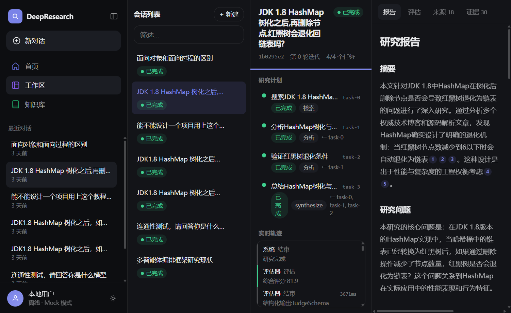
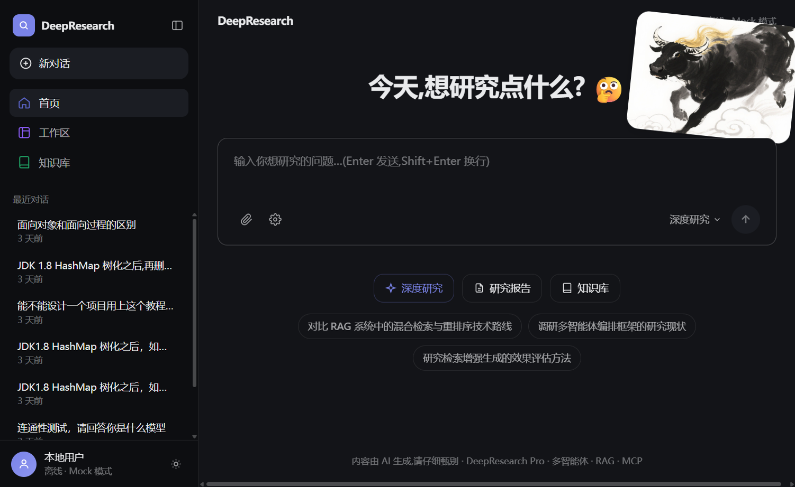
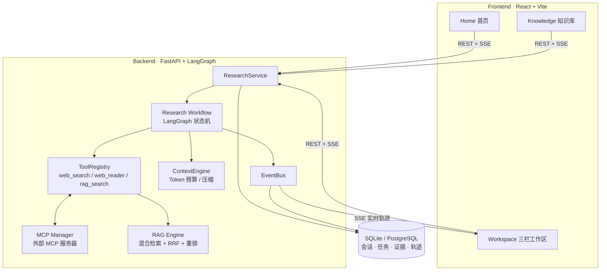
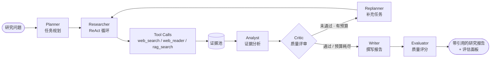

# DeepResearch Pro — AI 自主研究平台

> **一个问题进去,一份带引用、带质量评分的研究报告出来。**
> Multi-Agent Deep Research Platform · 多智能体 × 检索增强生成(RAG)× MCP 工具协议


**技术关键词**:Multi-Agent · RAG · MCP · LangGraph · FastAPI · React · SSE · Docker

## 核心数据

| | | | |
|---|---|---|---|
| **7** 个协作智能体 | **4** 阶段混合检索流水线 | **5** 种内置工具 + MCP 扩展 | **32** 个自动化测试 |
| **6** 种知识库文档格式 | **1.2 万** 行工程代码 | **0** 配置即可离线运行 | **1** 条命令 Docker 部署 |

## 为什么值得看

- **完整的多智能体系统**:7 个 Agent(规划 → 检索 → 分析 → 评审 → 撰写 → 评估)在 LangGraph 状态机上协作,支持反思循环与自动重规划 —— 不是 demo 级串行调用
- **生产思路的 RAG**:BM25 关键词 + 向量语义双路召回,RRF 融合,重排序精排 —— 工业界主流的混合检索架构,支持中文分词
- **标准的工程化实践**:分层架构(路由 / 服务 / 仓储)、统一异常处理、结构化输出校验 + 自动重试、全链路 Trace 事件、32 个离线确定性测试
- **AI 时代的热点全覆盖**:Agent 工作流、RAG、MCP 工具协议、上下文工程(Token 预算 / 证据优先级)、SSE 实时推送 —— 面试聊到哪一块都有实代码可指

## 界面预览

**工作区 —— 研究计划 · 实时执行轨迹 · 带引用报告与质量评分**



**首页 —— 输入研究问题即可开始**



## 快速验证(30 秒跑通)

无需任何 API Key,离线模式全流程可运行:

```bash
# 后端
cd backend && pip install -e . && python -m uvicorn app.main:app --port 8000
# 前端(另一个终端)
cd frontend && npm install && npm run dev
```

打开 http://localhost:5173 → 输入研究问题 → 实时观看多智能体协作 → 获得带引用的报告。详见下方[快速开始](#快速开始本地开发)。

## 功能特性

- **多智能体工作流**:Planner → Researcher → Retriever → Analyst → Critic → Writer → Evaluator,LangGraph 状态机编排,支持反思循环与自动重规划
- **混合检索**:向量检索 + BM25(jieba 中文分词)+ RRF 融合 + 重排序
- **知识库**:上传 txt/md/pdf/docx/csv/json,自动分块、嵌入、索引,研究时可引用私有语料
- **上下文工程**:Token 预算管理、证据优先级选择、压缩,保证长研究不爆上下文
- **工具系统**:web_search / web_reader / file_reader / calculator / rag_search,统一超时 + 重试 + 追踪语义
- **MCP 集成**:外部 MCP 服务器启动时自动接入,与内置工具共享同一注册中心
- **可观测性**:全链路 Trace 事件(SSE 实时推送 + 持久化),报告质量自动评估(完成度 / 引用分 / 证据质量)
- **Linear/Vercel 风格 UI**:三栏工作区、实时执行轨迹、明暗主题、响应式布局

## 架构



## 研究工作流



## 技术栈

| 层 | 技术 |
|----|------|
| 后端 | Python 3.11 · FastAPI · LangGraph · SQLAlchemy(async)· Pydantic v2 |
| 检索 | NumPy 向量索引 · jieba BM25 · RRF 融合 |
| 前端 | React 18 · TypeScript · Vite · Zustand · Tailwind CSS |
| 存储 | SQLite(默认)· PostgreSQL(可选)· InMemory/Redis 缓存 |

## 快速开始(本地开发)

### 1. 后端

```bash
cd backend
python -m venv .venv
.venv\Scripts\pip install -e ".[dev]"      # Windows
# Linux/macOS: .venv/bin/pip install -e ".[dev]"

.venv\Scripts\python -m uvicorn app.main:app --port 8000 --reload
```

启动日志出现 `No LLM_API_KEY configured — using MockLLMProvider (offline mode)` 即为离线模式,全流程可运行。

### 2. 前端

```bash
cd frontend
npm install
npm run dev        # http://localhost:5173(Vite 已代理 /api → 8000)
```

> 注意:构建需要 Node ≥ 18(Vite 5 要求)。若系统存在多个 Node,请确保使用较新版本。

### 3. 使用

1. 打开 `http://localhost:5173`,在首页输入研究问题(或点击示例问题)
2. 工作区实时展示:研究计划、任务状态、Agent 执行轨迹(SSE)
3. 完成后右侧查看:Report(带引用)· Evaluation(质量评分)· Sources · Evidence

## 快速开始(Docker)

```bash
# 在项目根目录
docker compose up --build
# 前端: http://localhost:5173   后端: http://localhost:8000/api/health
```

- 后端镜像内含 `config.yaml`,数据卷挂载至 `./data`
- nginx 以 `proxy_buffering off` 转发 `/api`(含 SSE)
- 需要真实 LLM 时,在根目录创建 `.env`(参考 `.env.example`)后 `docker compose up` 即自动注入
- 本仓库交付时构建环境无 Docker 守护进程,镜像未实际构建验证;本地开发路径已完整验证

## 配置

### 环境变量(`.env`,均可选)

| 变量 | 默认 | 说明 |
|------|------|------|
| `LLM_API_KEY` | 空 | 空 = Mock LLM 离线模式 |
| `LLM_BASE_URL` | `https://api.openai.com/v1` | OpenAI 兼容端点 |
| `LLM_MODEL` | `gpt-4o-mini` | 模型名 |
| `DATABASE_URL` | SQLite `./data/deepresearch.db` | 可切换 PostgreSQL |
| `WEB_SEARCH_PROVIDER` | `duckduckgo` | `duckduckgo` / `serpapi` / `none` |
| `CORS_ORIGINS` | `http://localhost:5173,…` | 前端来源 |

### 调参(`config.yaml`)

- `research.max_reflection_iterations` — 反思/重规划轮数(默认 2)
- `retrieval.*` — 分块大小、top_k、重排数量
- `context.max_tokens` — 上下文预算
- `mcp.servers` — 外部 MCP 服务器(`scripts/mcp_demo_server.py` 提供示例)

## API 一览

| 方法 | 路径 | 说明 |
|------|------|------|
| GET | `/api/health` | 健康检查 |
| POST | `/api/research` | 创建研究任务(异步执行) |
| GET | `/api/research` | 会话列表 |
| GET | `/api/research/{id}` | 会话详情(状态/迭代/任务计数) |
| GET | `/api/research/{id}/tasks` | 研究计划与任务状态 |
| GET | `/api/research/{id}/report` | 生成的报告(Markdown) |
| GET | `/api/research/{id}/evaluation` | 质量评估(总分/分项/建议) |
| GET | `/api/research/{id}/sources` | 来源列表 |
| GET | `/api/research/{id}/evidence` | 证据列表 |
| GET | `/api/research/{id}/trace` | 历史轨迹 |
| GET | `/api/research/{id}/events` | SSE 实时事件流 |
| POST | `/api/knowledge/documents` | 上传知识库文档 |
| GET | `/api/knowledge/documents` | 文档列表 |
| DELETE | `/api/knowledge/documents/{id}` | 删除文档 |
| POST | `/api/knowledge/search` | 知识库混合检索 |

## 测试

```bash
cd backend
.venv\Scripts\python -m pytest tests -q       # 32 passed(离线、确定性)
```

覆盖:向量存储索引一致性、RAG 混合检索与上下文构建、任务调度依赖、MockLLM 结构化输出、全工作流集成(规划→执行→反思→报告→评估)。

## 项目结构

```
deepresearch-pro/
├── backend/
│   ├── app/
│   │   ├── agents/          # planner / researcher / analyst / critic / writer / evaluator
│   │   ├── api/routes/      # research / knowledge / health
│   │   ├── core/            # llm / tool / registry / context / memory / errors
│   │   ├── rag/             # embedding / vectorstore / bm25 / fusion / engine
│   │   ├── graph/           # LangGraph workflow + state
│   │   ├── services/        # research / knowledge services, DI container
│   │   ├── observability/   # TraceEvent / EventBus / SSE
│   │   └── db.py / models.py / repositories
│   └── tests/               # unit + integration(离线 Mock)
├── frontend/
│   └── src/
│       ├── pages/           # Home / Workspace / Knowledge
│       ├── components/      # AppShell + ui 组件库
│       ├── store/           # zustand(research / theme)
│       └── lib/             # api client / types
├── docs/                    # 实施计划与进度
├── scripts/                 # MCP demo / 冒烟脚本
├── config.yaml              # 运行时调参
├── docker-compose.yml       # api + web(nginx)编排
└── .env.example
```

## 已知限制

- 离线模式下检索结果来自确定性种子语料,报告内容用于验证流程而非真实研究结论
- DuckDuckGo 公共搜索为尽力而为(可能被限流),生产建议接入 SerpAPI 或学术索引
- 研究执行为进程内后台任务(单 worker);多副本部署需引入任务队列
