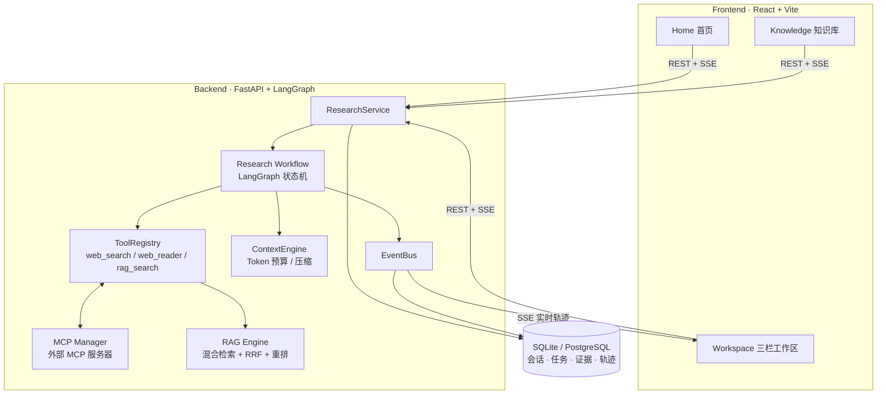

# DeepResearch Pro — AI 自主研究平台

> **一个问题进去,一份带引用、带质量评分的研究报告出来。**
> Multi-Agent Deep Research Platform · 多智能体 × 检索增强生成(RAG)× MCP 工具协议


**技术关键词**:Multi-Agent · RAG · MCP · LangGraph · FastAPI · React · SSE · Docker

## 核心数据

| | | | |
|---|---|---|---|
| **7** 个协作智能体 | **4** 阶段混合检索流水线 | **5** 种内置工具 + MCP 扩展 | **15** 个 REST/SSE 接口 |
| **6** 种知识库文档格式 | **1.2 万** 行工程代码 | **32** 个自动化测试 | **1** 条命令 Docker 部署 |

## 界面预览

**工作区 —— 研究计划 · 实时执行轨迹 · 带引用报告与质量评分**


**首页 —— 输入研究问题即可开始**


## 这个项目解决什么问题

大模型的"深度研究"(Deep Research)正在成为 AI 产品的标配形态:用户提出一个开放性问题,系统自动拆解任务、联网检索、交叉验证,最终产出一份有据可查的研究报告。OpenAI Deep Research、Perplexity 等闭源产品证明了这一范式的价值,但它们是黑盒 —— 无法自部署、无法替换模型、无法定制检索策略。

**DeepResearch Pro 是这一范式的完整开源复刻**:从多智能体编排、混合检索、MCP 工具协议到上下文工程,每个环节都是可读、可改、可部署的生产代码。模型层做了抽象,OpenAI / DeepSeek / 通义千问等任意 OpenAI 兼容接口均可即插即用;没有 API Key 时内置 Mock 提供商,零配置离线跑通全流程。

典型使用场景:技术选型调研、竞品分析、学术综述初稿、面试题深挖(例如"HashMap 树化后退化为链表的边界条件"这类需要多来源交叉的问题)。

## 五大核心亮点

### 1. 多智能体协作 —— 7 个 Agent 在状态机上编排

不是"一个大 Prompt 包打天下",而是职责分离的流水线:**Planner**(任务拆解)→ **Researcher**(ReAct 循环检索)→ **Retriever**(证据入库)→ **Analyst**(证据分析)→ **Critic**(质量评审)→ **Writer**(报告撰写)→ **Evaluator**(量化评分)。

- 基于 **LangGraph 状态机**驱动,每个 Agent 是图上的一个节点,状态(任务池、证据池、迭代轮次)全局流转
- 支持**反思循环**:Critic 评审不通过时,Replanner 自动补充新任务再次研究(轮数可配,默认 2 轮)
- 支持**依赖调度**:任务间有依赖关系时按拓扑序执行,无依赖的任务可并发(信号量控制并发度)

### 2. 工业级混合检索 —— 4 阶段 RAG 流水线

单一向量检索对关键词、编号类查询召回差,纯 BM25 对语义改写无能为力 —— 本项目实现了工业界主流的混合架构:

| 阶段 | 技术 | 说明 |
|---|---|---|
| ① 分块 | 700 token 窗口 / 120 重叠 | 平衡语义完整性与检索粒度 |
| ② 双路召回 | NumPy 向量索引 + jieba BM25 | 语义相似度 + 关键词命中各取 top-k |
| ③ 融合 | RRF(倒数排名融合) | 免调参地合并两路排名,鲁棒性优于加权分数 |
| ④ 精排 | 重排序模型 | 对融合后的候选做精细化排序 |

中文场景专门优化:jieba 中文分词、中文停用词处理、全角/半角归一化。

### 3. MCP 工具协议 —— 可扩展的工具生态

工具层遵循 **Model Context Protocol** 标准:内置 `web_search` / `web_reader` / `file_reader` / `calculator` / `rag_search` 五种工具,外部 MCP 服务器启动时自动接入,与内置工具共享同一注册中心(统一超时、重试、追踪语义)。仓库自带 `scripts/mcp_demo_server.py` 示例,可照此接入任意自有工具 —— 工具生态零侵入扩展。

### 4. 上下文工程 —— 长研究不爆上下文

多智能体 + 多轮检索最大的工程风险是上下文膨胀。本项目内置 ContextEngine:

- **Token 预算管理**:为每次 LLM 调用设定硬预算(默认 16000,预留输出 3000)
- **证据优先级选择**:按相关度与置信度排序,优先携带高价值证据
- **历史压缩**:多轮轨迹超预算时自动压缩,保留决策要点

### 5. 全链路可观测 + 自动质量评估

- **每个 Agent 的每次决策、每次工具调用、每次状态变更**都产生 Trace 事件:SSE 实时推送到前端轨迹面板,同时持久化到数据库可回放
- 研究完成后 **Evaluator 自动产出四维评分**:任务完成度 / 引用得分 / 证据质量 / 评审均分,汇成综合分与改进建议(见截图右栏)

## 一次真实研究的完整旅程

以真实运行的一次研究为例 —— 提问"**面向对象和面向过程的区别**":

1. **规划**:Planner 拆解出 4 个子任务(概念定义 / 核心差异 / 优劣势对比 / 适用场景)
2. **执行**:Researcher 对每个任务发起 ReAct 循环,自主决定调用 `web_search` 的关键词与次数,网页正文经 `web_reader` 抽取后入库
3. **分析**:Analyst 将检索结果提炼为带置信度的结构化证据
4. **评审**:Critic 检查证据覆盖度,通过后进入撰写
5. **产出**:最终报告 **4/4 任务全部完成、引用 18 个来源、沉淀 30 条证据、综合评分 81.9/100**,报告内每个论断都带 `[1][2]` 式编号引用,可溯源

上图的"评估"面板就是第 5 步的产物。

## 架构



## 研究工作流


## 工程质量

- **测试**:32 个离线、确定性测试(向量索引一致性 / 混合检索 / 依赖调度 / 结构化输出 / 全工作流集成),不依赖网络与真实模型,秒级跑完
- **健壮的 LLM 交互**:Pydantic Schema 严格校验结构化输出;解析失败时把具体错误回传给模型自动重试;内置 JSON 修复层(尾随逗号 / 缺失分隔符 / 未闭合括号),实测将真实模型的格式错误率降至接近零
- **优雅降级**:单个网页反爬、单条证据检索失败不会拖垮整个研究,任务级 try/except 隔离并记录 ERROR 轨迹
- **分层架构**:路由 → 服务 → 仓储三层解耦,依赖注入容器管理生命周期;LLM 提供商抽象化,业务代码只依赖接口不依赖厂商

## 技术栈

| 层 | 技术 |
|----|------|
| 后端 | Python 3.11 · FastAPI · LangGraph · SQLAlchemy(async)· Pydantic v2 |
| 检索 | NumPy 向量索引 · jieba BM25 · RRF 融合 |
| 前端 | React 18 · TypeScript · Vite · Zustand · Tailwind CSS |
| 存储 | SQLite(默认)· PostgreSQL(可选)· InMemory/Redis 缓存 |

## 快速验证(30 秒跑通)

无需任何 API Key,离线模式全流程可运行:

```bash
# 后端
cd backend && pip install -e . && python -m uvicorn app.main:app --port 8000
# 前端(另一个终端)
cd frontend && npm install && npm run dev
```

打开 http://localhost:5173 → 输入研究问题 → 实时观看多智能体协作 → 获得带引用的报告。

## 快速开始(本地开发)

### 1. 后端

```bash
cd backend
python -m venv .venv
.venv\Scripts\pip install -e ".[dev]"      # Windows
# Linux/macOS: .venv/bin/pip install -e ".[dev]"

.venv\Scripts\python -m uvicorn app.main:app --port 8000 --reload
```

启动日志出现 `No LLM_API_KEY configured — using MockLLMProvider (offline mode)` 即为离线模式,全流程可运行。

### 2. 前端

```bash
cd frontend
npm install
npm run dev        # http://localhost:5173(Vite 已代理 /api → 8000)
```

> 注意:构建需要 Node ≥ 18(Vite 5 要求)。若系统存在多个 Node,请确保使用较新版本。

### 3. 使用

1. 打开 `http://localhost:5173`,在首页输入研究问题(或点击示例问题)
2. 工作区实时展示:研究计划、任务状态、Agent 执行轨迹(SSE)
3. 完成后右侧查看:Report(带引用)· Evaluation(质量评分)· Sources · Evidence
4. 接入真实模型:界面右上角「API 配置」填入 Base URL / 模型名 / API Key,自动探测连通性并持久化

## 快速开始(Docker)

```bash
# 在项目根目录
docker compose up --build
# 前端: http://localhost:5173   后端: http://localhost:8000/api/health
```

- 后端镜像内含 `config.yaml`,数据卷挂载至 `./data`
- nginx 以 `proxy_buffering off` 转发 `/api`(含 SSE)
- 需要真实 LLM 时,在根目录创建 `.env`(参考 `.env.example`)后 `docker compose up` 即自动注入

## 配置

### 环境变量(`.env`,均可选)

| 变量 | 默认 | 说明 |
|------|------|------|
| `LLM_API_KEY` | 空 | 空 = Mock LLM 离线模式 |
| `LLM_BASE_URL` | `https://api.openai.com/v1` | OpenAI 兼容端点 |
| `LLM_MODEL` | `gpt-4o-mini` | 模型名 |
| `DATABASE_URL` | SQLite `./data/deepresearch.db` | 可切换 PostgreSQL |
| `WEB_SEARCH_PROVIDER` | `duckduckgo` | `duckduckgo` / `serpapi` / `none` |
| `CORS_ORIGINS` | `http://localhost:5173,…` | 前端来源 |

### 调参(`config.yaml`)

- `research.max_reflection_iterations` — 反思/重规划轮数(默认 2)
- `retrieval.*` — 分块大小、top_k、重排数量
- `context.max_tokens` — 上下文预算
- `mcp.servers` — 外部 MCP 服务器(`scripts/mcp_demo_server.py` 提供示例)

## API 一览

| 方法 | 路径 | 说明 |
|------|------|------|
| GET | `/api/health` | 健康检查 |
| POST | `/api/research` | 创建研究任务(异步执行) |
| GET | `/api/research` | 会话列表 |
| GET | `/api/research/{id}` | 会话详情(状态/迭代/任务计数) |
| GET | `/api/research/{id}/tasks` | 研究计划与任务状态 |
| GET | `/api/research/{id}/report` | 生成的报告(Markdown) |
| GET | `/api/research/{id}/evaluation` | 质量评估(总分/分项/建议) |
| GET | `/api/research/{id}/sources` | 来源列表 |
| GET | `/api/research/{id}/evidence` | 证据列表 |
| GET | `/api/research/{id}/trace` | 历史轨迹 |
| GET | `/api/research/{id}/events` | SSE 实时事件流 |
| POST | `/api/knowledge/documents` | 上传知识库文档 |
| GET | `/api/knowledge/documents` | 文档列表 |
| DELETE | `/api/knowledge/documents/{id}` | 删除文档 |
| POST | `/api/knowledge/search` | 知识库混合检索 |

## 测试

```bash
cd backend
.venv\Scripts\python -m pytest tests -q       # 32 passed(离线、确定性)
```

覆盖:向量存储索引一致性、RAG 混合检索与上下文构建、任务调度依赖、MockLLM 结构化输出、全工作流集成(规划→执行→反思→报告→评估)。

## 项目结构

```
deepresearch-pro/
├── backend/
│   ├── app/
│   │   ├── agents/          # planner / researcher / analyst / critic / writer / evaluator
│   │   ├── api/routes/      # research / knowledge / health / settings
│   │   ├── core/            # llm / tool / registry / context / memory / errors
│   │   ├── rag/             # embedding / vectorstore / bm25 / fusion / engine
│   │   ├── graph/           # LangGraph workflow + state
│   │   ├── services/        # research / knowledge services, DI container
│   │   ├── observability/   # TraceEvent / EventBus / SSE
│   │   └── db.py / models.py / repositories
│   └── tests/               # unit + integration(离线 Mock)
├── frontend/
│   └── src/
│       ├── pages/           # Home / Workspace / Knowledge
│       ├── components/      # AppShell + ui 组件库
│       ├── store/           # zustand(research / theme)
│       └── lib/             # api client / types / 中文标签映射
├── docs/                    # 实施计划与进度
├── scripts/                 # MCP demo / 冒烟脚本
├── config.yaml              # 运行时调参
├── docker-compose.yml       # api + web(nginx)编排
└── .env.example
```

## 已知限制

- 离线模式下检索结果来自确定性种子语料,报告内容用于验证流程而非真实研究结论
- DuckDuckGo 公共搜索为尽力而为(可能被限流),生产建议接入 SerpAPI 或学术索引
- 研究执行为进程内后台任务(单 worker);多副本部署需引入任务队列

---

**作者**:夏书培 · AI 应用开发方向(多智能体 / RAG)· 本项目为独立开发的求职作品集项目,后端架构、检索流水线、前端界面与部署方案均为原创实现。
